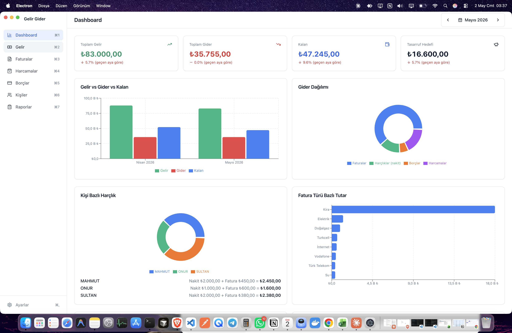
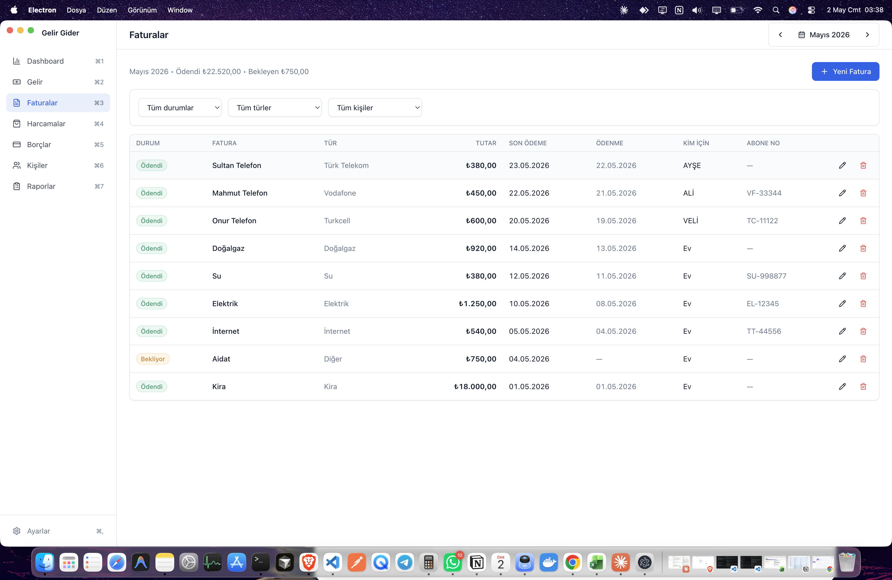
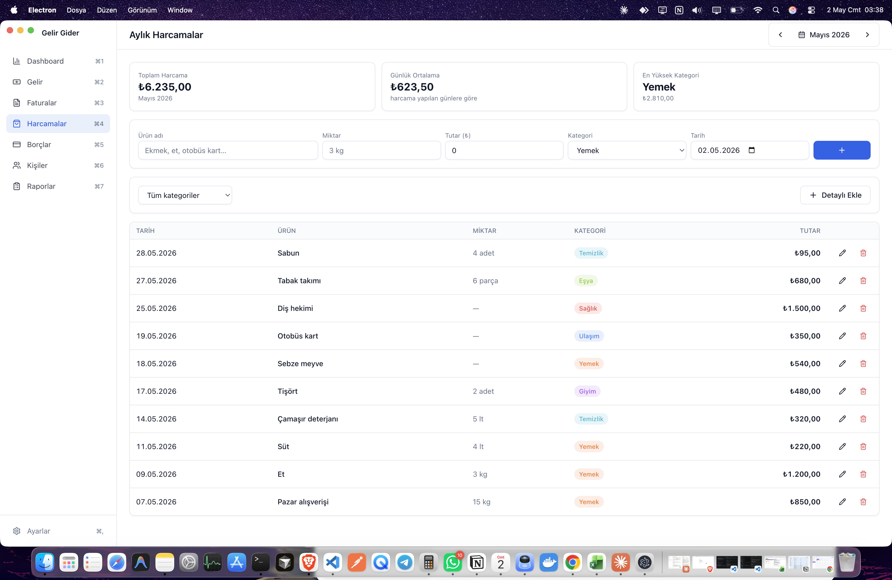
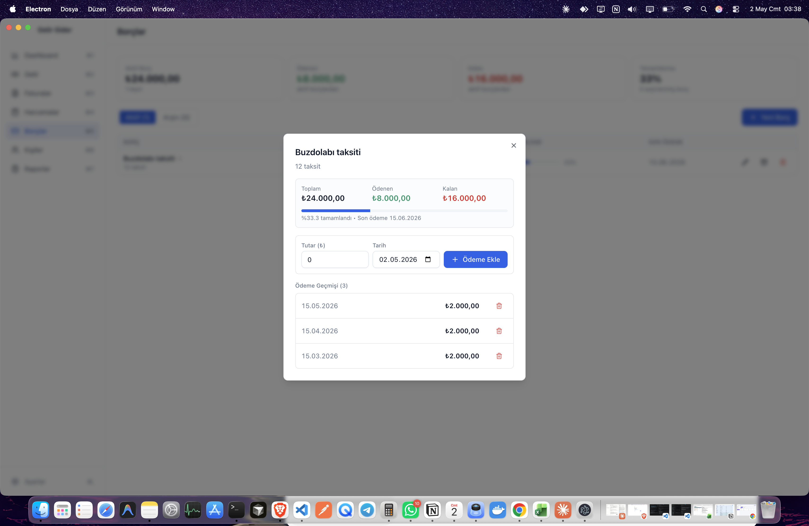
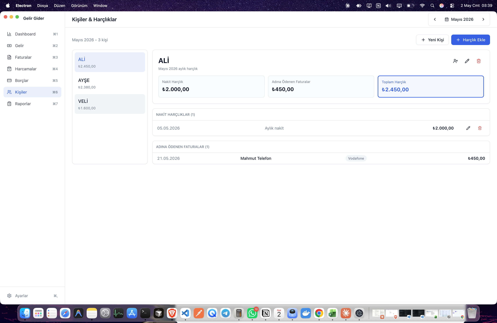
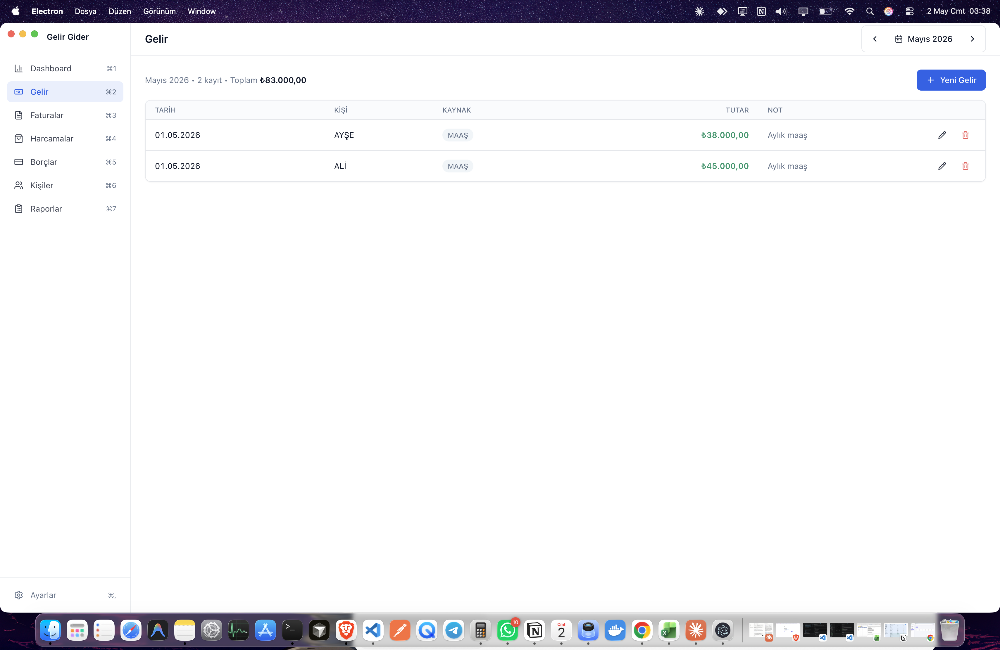
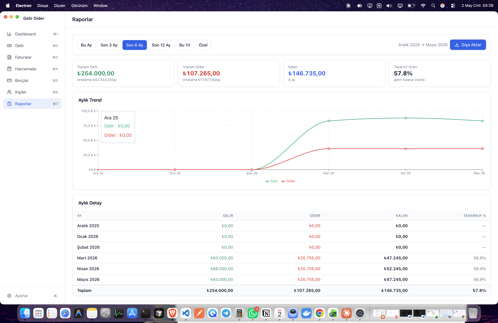

# MoneyFam

> Hane bütçesini birlikte yönetmek için macOS native masaüstü uygulaması.
> Gelir, fatura, harçlık, borç ve günlük harcama takibini ay bazlı tek bir yerde toplayan, **tamamen lokal çalışan** bir bütçe yöneticisi.

[](#)
[](#)
[](#)
[](#)
[](LICENSE)

---

## Neden MoneyFam?

Çoğu bütçe uygulaması bireysel kullanıcılar için tasarlanır. **MoneyFam hane bazlı düşünür**:

- 🏠 **Ev faturaları ile kişisel faturaları ayırır** — kim ne kadar tüketti, doğru görünür _([detaylı açıklama](#ev-faturas%C4%B1-vs-ki%C5%9Fisel-fatura))_
- 💸 **Otomatik harçlık formülü**: `verilen nakit + adına ödenmiş faturalar`
- 📊 **Çift sayma yok**: Toplam gider hesabı matematiksel olarak doğru
- 🔒 **Tamamen offline**: Veriler SQLite'ta lokalde, internet bağlantısı yok, telemetri yok
- 🧮 **Türkçe locale**: Para `1.234,56 ₺`, tarih `15.05.2026`

### Ev faturası vs kişisel fatura

Bir fatura eklerken "**Kim için?**" alanı vardır:

| Seçim | Anlamı | Örnekler |
|---|---|---|
| **Ev (paylaşımlı)** | Hane gideri — herkesin sorumluluğu | Kira, elektrik, su, doğalgaz, internet |
| **Bir kişi** (örn. Onur) | O kişinin **harçlığına yazılır** | Onur'un telefon faturası, Mahmut'un özel sigortası |

**Somut bir örnek** — Mayıs 2026'da:

```
Onur için yapılan giderler:
  ↳ 1.000 ₺  nakit harçlık verildi
  ↳   600 ₺  Onur'un Turkcell faturası ödendi  (kim için: Onur)
  ───────
  1.600 ₺   Onur'un Mayıs ayı toplam harçlığı

Hane (ev) faturaları:
  ↳ 18.000 ₺  Kira              (kim için: Ev)
  ↳  1.250 ₺  Elektrik           (kim için: Ev)
  ↳    540 ₺  İnternet           (kim için: Ev)
  ───────
  19.790 ₺   Aylık ev gideri
```

**Neden böyle?** Onur'un telefon faturası bir "ev gideri" değil — Onur'un kişisel tüketimi. Onu ev faturalarına eklerseniz, "ev ne kadar tüketti?" sorusunun cevabı şişer ve "Onur ne kadar tüketti?" sorusunun cevabı eksik kalır.

Dashboard'da:
- **Toplam Gider**'de fatura **bir kez** sayılır (çift sayma yok)
- **Kişi Bazlı Harçlık** grafiğinde Onur'un dilimi 1.600 ₺ gösterilir
- **Fatura Türü Dağılımı**'nda Turkcell + diğer telefon faturaları ayrı bir dilim olur

## Ekran Görüntüleri

### Dashboard — Aylık özet, KPI'lar ve grafikler



### Faturalar — Durum cycle, kişisel/ev ayrımı, tekrar eden fatura



### Aylık Harcamalar — Inline hızlı ekleme, kategori renkleri, ay özeti



### Borçlar — Detay modal'ı, ödeme geçmişi, otomatik arşivleme



### Kişiler & Harçlıklar — Nakit + adına ödenen faturalar



### Gelir — Kişi ve kaynak bazlı



### Raporlar — Tarih aralığı, trend, dışa aktarma



## Özellikler

### 8 Sayfa

| Sayfa | Kısayol | Ne Yapar |
|---|---|---|
| **Dashboard** | `⌘1` | 4 KPI + 6 grafik + son 7 gün yaklaşan ödemeler |
| **Gelir** | `⌘2` | Maaş + ek gelir, kişi bazlı |
| **Faturalar** | `⌘3` | Ev/kişisel ayrımı, durum cycle, **tekrar eden** şablon |
| **Harcamalar** | `⌘4` | Inline hızlı ekleme, kategori renkleri, ay özeti |
| **Borçlar** | `⌘5` | Kredi/taksit takibi, ödeme geçmişi, otomatik arşivleme |
| **Kişiler & Harçlıklar** | `⌘6` | Kişi başına: nakit + adına ödenen faturalar dökümü |
| **Raporlar** | `⌘7` | 6 ön ayarlı tarih aralığı, PDF/CSV/DB export |
| **Ayarlar** | `⌘,` | Tasarruf hedefi, tema (light/dark/system), yedekleme |

### İş Mantığı (Test Edilmiş)

**Kişinin aylık toplam harçlığı:**
```
harçlık = nakit verilen + adına ödenmiş faturalar (status='Ödendi')
```

**Aylık toplam gider** (çift sayma yok):
```
toplam_gider = ev_faturaları + nakit_harçlıklar + kişisel_faturalar
             + borç_ödemeleri + harcamalar
```

Bir kişisel fatura **bir kez** sayılır — hem kişi harçlığında hem toplam giderde dahil olur ama ev faturası kategorisi ile çakışmaz.

### Otomasyon

- 🔁 **Tekrar eden faturalar**: "Her ay otomatik oluştur" işaretli faturalar her ay başında "Bekliyor" durumunda kopyalanır (Ocak 31 → Şubat 28/29 otomatik clamp)
- 🔔 **Native bildirimler**: Her gün 09:00'da, son ödeme tarihi yaklaşan/geciken fatura ve borçlar için macOS notification
- 💾 **Otomatik yedekleme**: Her Pazar 03:00'da `userData/backups/` altına kopyalanır, son 8 yedek tutulur
- 📤 **Manuel yedekleme & geri yükleme**: Tek tıkla `.db` export, başka Mac'e taşı, kayıpsız geri yükle

### Dışa Aktarma

- **PDF rapor** — `webContents.printToPDF()` ile, ekstra dependency yok
- **CSV** — 6 tablodan biri veya hepsi (Excel uyumlu, Türkçe karakter destekli BOM ile)
- **DB yedek** — SQLite dosyasını seçilen klasöre kopyala

## Kurulum

### Gereksinimler

- macOS 11+ (Apple Silicon veya Intel)
- Node.js 18+ (önerilen: **Node.js 20 LTS** — `better-sqlite3` daha sorunsuz derlenir)
- Python 3 + setuptools (Python 3.12+ için `pip3 install setuptools` gerekli)

### Kurulum

```bash
git clone https://github.com/onurgncode/MoneyFam.git
cd MoneyFam
npm install
```

> `better-sqlite3` native modüldür, postinstall hook'u ile otomatik derlenir.

#### Python 3.12+ Sorunu (`distutils`)

Eğer `ModuleNotFoundError: No module named 'distutils'` hatası alırsanız:

```bash
pip3 install setuptools --break-system-packages
node node_modules/.bin/electron-builder install-app-deps
```

#### `--ignore-scripts` ile Kurulduysa

```bash
node node_modules/electron/install.js                       # Electron binary
node node_modules/.bin/electron-builder install-app-deps    # Native modüller
```

## Kullanım

```bash
# Geliştirme modu (HMR)
npm run dev

# Demo verisiyle başlat (3 aylık örnek veri)
npm run dev:demo

# macOS universal .dmg üretimi
npm run build:mac

# Test
npm test
```

## Klavye Kısayolları

| Kısayol | Aksiyon |
|---|---|
| `⌘1` – `⌘7` | Sayfa değiştir |
| `⌘,` | Ayarlar |
| `⌘N` | Aktif sayfada yeni kayıt |
| `⌘E` | Dışa aktar (Raporlar açılır) |

## Mimari

### Stack

- **Electron 32** + electron-vite (HMR, TypeScript out-of-the-box)
- **React 18** + TypeScript strict mode
- **Tailwind CSS** + shadcn/ui-style bileşenler
- **better-sqlite3** (sync, prepared statements)
- **Recharts** (grafikler)
- **Zustand** (state) + **react-hook-form** + **zod** (form & validation)
- **Vitest** (74 unit test)

### Process Modeli

```
┌─────────────┐     IPC      ┌────────────┐     ipcMain     ┌──────────┐
│   Renderer  │ ──────────►  │   Preload  │ ──────────────► │   Main   │
│  (React UI) │              │ contextBr. │                 │  (DB)    │
└─────────────┘              └────────────┘                 └──────────┘
                                                                  │
                                                                  ▼
                                                            SQLite (WAL)
```

- **Main process**: SQLite + IPC + native API (file dialog, notification, printToPDF)
- **Preload**: contextIsolation + type-safe bridge — sadece tanımlı IPC yüzeyi expose edilir
- **Renderer**: React, Node.js erişimi yok

### Klasör Yapısı

```
src/
├── main/                    # Electron main process
│   ├── db/
│   │   ├── migrations/      # 003 versiyonlu SQL dosyaları
│   │   └── repositories/    # Tip güvenli CRUD + agregasyon
│   ├── ipc/                 # Tüm IPC handler'ları
│   ├── notifications/       # Günlük 09:00 cron
│   ├── backup/              # CSV/DB/PDF + auto-weekly cron
│   └── scheduling-helpers.ts # Pure date helpers (test edilebilir)
├── preload/                 # contextBridge köprüsü
├── renderer/                # React UI
│   ├── components/{ui,layout,charts,common}/
│   ├── pages/               # 8 sayfa + form modalleri
│   ├── stores/              # Zustand
│   └── lib/                 # currency, date, validators, calc
└── shared/                  # main↔renderer ortak tipler
    ├── types.ts
    ├── ipc-contract.ts
    └── constants.ts

tests/                       # Vitest birim testleri
├── calc/                    # business logic (61 test)
└── validators/              # zod schemas (13 test)
```

## Veri Modeli

7 tablo, 3 migration:

| Tablo | Amaç |
|---|---|
| `persons` | Hane içindeki kişiler |
| `income` | Maaş + ek gelir kayıtları |
| `bills` | Faturalar (ev/kişisel ayrımı `paid_for_person_id` ile, `recurring` flag) |
| `allowances` | Verilen nakit harçlıklar |
| `debts` | Krediler/taksitler (`is_active` ile arşivleme) |
| `debt_payments` | Borç ödeme geçmişi |
| `expenses` | Günlük harcamalar (kategori bazlı) |
| `settings` | Tasarruf hedefi, tema, vs. |

Tüm sorgular **prepared statement** ile parametriktir (SQL injection koruması). Indexler: `date`, `person_id`, `status`, `recurring` üzerinde.

## Veri Konumu

```bash
~/Library/Application Support/MoneyFam/
├── budget.db                              # Ana veritabanı
└── backups/
    ├── budget-20260502-0328.db            # Otomatik haftalık yedek
    ├── budget-pre-restore-20260502-0410.db # Geri yükleme öncesi otomatik
    └── ...                                # Son 8 yedek
```

Yedek `.db` dosyasını başka bir Mac'e taşıyıp uygulamayı açtığınızda tüm verileriniz görünür.

## Test

```bash
npm test           # 74 test, ~400ms
npm run test:watch # watch modu
```

| Test Dosyası | Test Sayısı | Kapsam |
|---|---|---|
| `tests/calc/allowance.test.ts` | 9 | Kişi başına aylık harçlık (nakit + adına ödenen faturalar) |
| `tests/calc/monthly.test.ts` | 11 | Aylık toplam gelir/gider, çift sayma yok kontrolü |
| `tests/calc/trends.test.ts` | 4 | 6 aylık trend, ay/yıl sınırı |
| `tests/calc/range.test.ts` | 15 | Tarih aralığı sınırları, ay listeleri, CSV escape |
| `tests/calc/recurring.test.ts` | 13 | Tekrar eden fatura tarih matematiği (ay sonu, artık yıl) |
| `tests/calc/scheduler.test.ts` | 9 | Haftalık ve günlük zamanlayıcı uzaklık hesabı |
| `tests/validators/debt.test.ts` | 13 | Borç/ödeme/kişi zod schema'ları |

## Katkıda Bulunma

İssue açın veya PR gönderin. Geliştirme akışı:

```bash
npm run dev:demo       # Demo veriyle aç
npm run typecheck      # TypeScript strict kontrol
npm test               # Unit testler
npm run build          # Production bundle (test için)
```

Code style: TypeScript strict, repository pattern (DB erişimi tek katmanda), tüm form validasyonları zod, tüm DB sorguları parametrik.

## Yol Haritası

- [ ] Çoklu para birimi
- [ ] Bütçe planlama (kategori bazlı aylık limitler)
- [ ] iCloud Drive yedekleme
- [ ] iOS / iPadOS sürümü (SwiftUI + paylaşılan SQLite)
- [ ] Tahminsel analizler (önümüzdeki ay tahmini)

## Lisans

MIT © [Onur Genç](https://github.com/onurgncode)

---

> **Privacy first**: MoneyFam hiçbir veriyi sunucuya göndermez. Tüm hesaplar lokal SQLite üzerinde çalışır. Telemetri, analytics, crash reporting yoktur.
